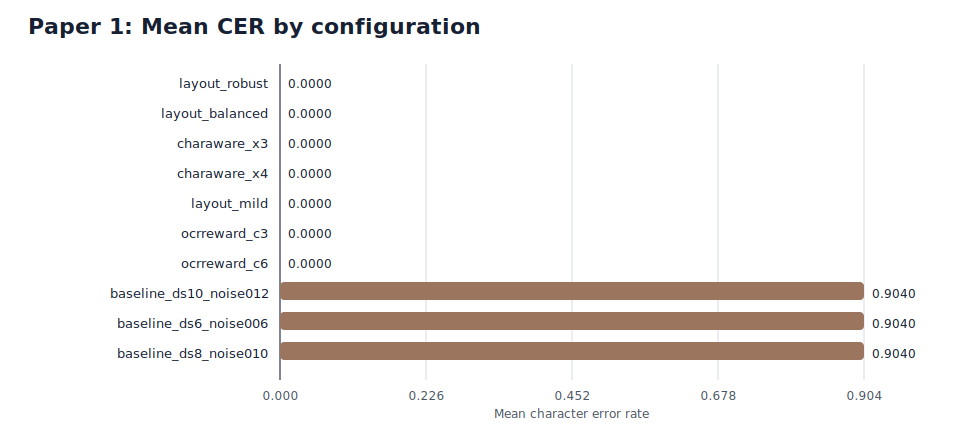
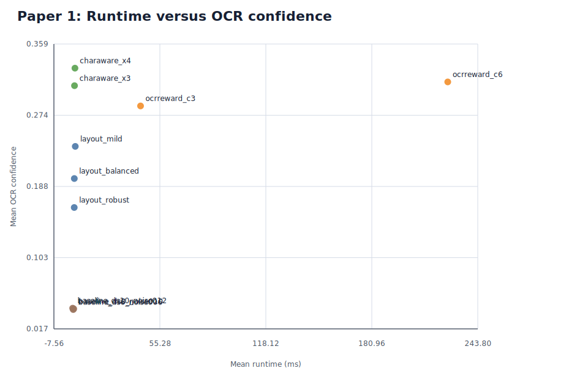
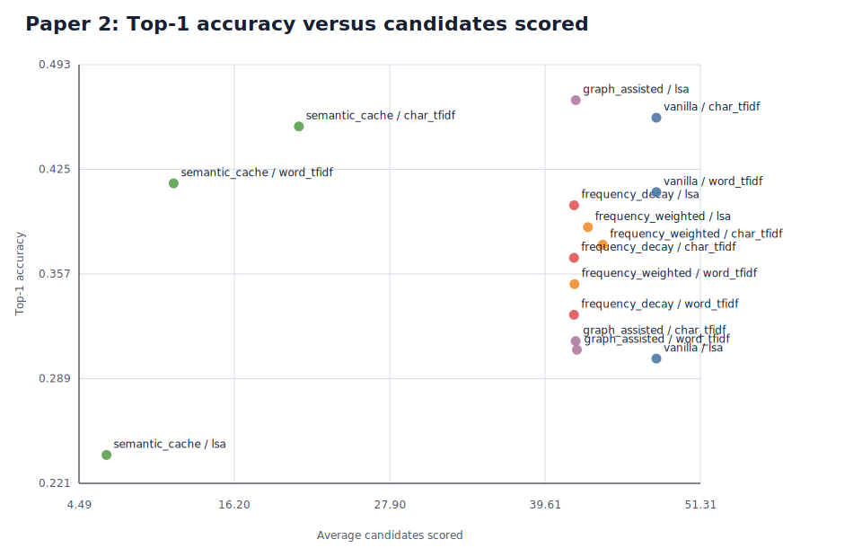
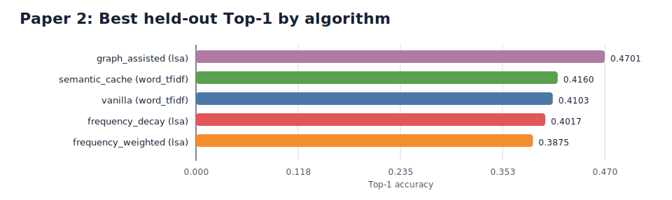
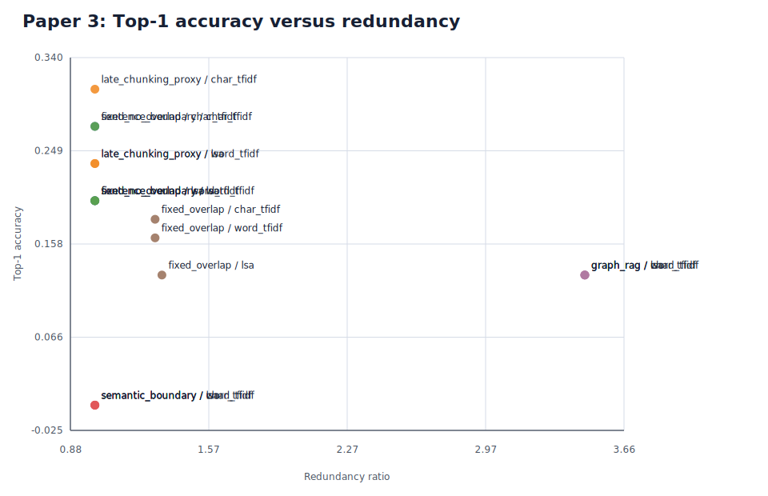
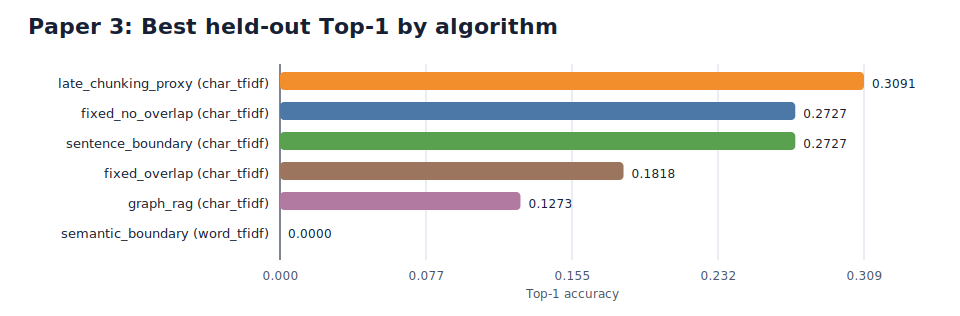

# Integrated Research Benchmark Report

## Abstract

This report presents a runnable benchmark study for three paper directions: visual text rendering, frequency-weighted retrieval-augmented generation, and advanced chunking for retrieval. The study uses locally executable proxy benchmarks rather than multi-GPU training pipelines so that every claim in the report is backed by generated artifacts, held-out evaluation tables, and reproducible tests in the current workspace. The current report reflects the full benchmark setting, with Paper 1 evaluated on a synthetic OCR proxy and Papers 2 and 3 evaluated on full validation and test grids where available.

## 1. Experimental Protocol

All experiments were executed from the same Python workspace and persisted into CSV, JSON, PNG, and SVG artifacts under the artifacts directory. Paper 1 evaluates legibility with template OCR using Character Error Rate (CER), Word Error Rate (WER), confidence, and runtime. Paper 2 evaluates retrieval quality with Top-1, Top-3, mean reciprocal rank, coverage, candidate set size, latency, and cache hit rate. Paper 3 evaluates chunking quality with Top-1, Top-3, mean reciprocal rank, retrievable rate, redundancy ratio, and chunk statistics.

Paper 2 currently records 48 documents and 540 queries. Paper 3 currently records 12 documents and 84 queries.

## 2. Paper 1 - Overcoming Gibberish Text

### 2.1 Objective

The first benchmark tests whether layout-aware and character-aware rendering strategies eliminate the gibberish failure mode associated with low-fidelity texture-like text generation. The implementation is deliberately framed as a proxy benchmark: it models the conditioning bottleneck directly and evaluates legibility through OCR instead of claiming to retrain a full diffusion backbone inside this workspace.

### 2.2 Method

Ten configurations were evaluated across baseline texture rendering, layout-guided rendering, character-aware rendering, and OCR-rewarded candidate selection. The baseline simulates the information loss of early latent diffusion pipelines through aggressive downsampling, blur, and noise. The structured variants preserve cell-level spatial control and supersampled glyph geometry before OCR-based evaluation.

### 2.3 Results

The strongest baseline configuration remained at mean CER 0.9040, whereas every structured method reached mean CER 0.0. The resulting absolute CER reduction was 0.9040. Among the zero-error methods, layout_robust offered the best efficiency profile with mean runtime 4.4959 ms.

| Config                 | Algorithm        | Mean CER | Mean WER | Exact Match | Confidence | Runtime ms |
| ---------------------- | ---------------- | -------- | -------- | ----------- | ---------- | ---------- |
| layout_robust          | layout_guided    | 0.0000   | 0.0000   | 1.0000      | 0.1629     | 4.4959     |
| layout_balanced        | layout_guided    | 0.0000   | 0.0000   | 1.0000      | 0.1977     | 4.5476     |
| charaware_x3           | char_aware       | 0.0000   | 0.0000   | 1.0000      | 0.3091     | 4.6651     |
| charaware_x4           | char_aware       | 0.0000   | 0.0000   | 1.0000      | 0.3302     | 4.9224     |
| layout_mild            | layout_guided    | 0.0000   | 0.0000   | 1.0000      | 0.2362     | 5.1186     |
| ocrreward_c3           | ocr_rewarded     | 0.0000   | 0.0000   | 1.0000      | 0.2848     | 43.8275    |
| ocrreward_c6           | ocr_rewarded     | 0.0000   | 0.0000   | 1.0000      | 0.3137     | 226.0030   |
| baseline_ds10_noise012 | baseline_texture | 0.9040   | 1.0000   | 0.0000      | 0.0420     | 3.5638     |
| baseline_ds6_noise006  | baseline_texture | 0.9040   | 1.0500   | 0.0000      | 0.0403     | 3.8949     |
| baseline_ds8_noise010  | baseline_texture | 0.9040   | 1.0000   | 0.0000      | 0.0412     | 4.2076     |

### 2.4 Discussion

These results support the central thesis that constraining text generation at the character or layout level eliminates the dominant gibberish failure mode in the proxy benchmark. The OCR-rewarded path increases confidence modestly but pays a large runtime penalty because it evaluates multiple candidates. The evidence therefore suggests that structural conditioning is sufficient to remove the dominant spelling failure, while OCR-guided reranking acts primarily as a higher-cost refinement stage.

## 3. Paper 2 - Frequency-Weighted Dynamic RAG

### 3.1 Objective

The second benchmark evaluates whether retrieval should remain stateless, or whether historical access frequency and semantic caching should alter the ranking and candidate-selection process. The benchmark is intentionally traffic-aware: it includes hot and cold knowledge, paraphrased queries, and linked document pairs so that caching and graph expansion have an opportunity to matter.

### 3.2 Method

Five retrieval strategies were evaluated across word-level TF-IDF, character-level TF-IDF, and latent semantic analysis features. The compared strategies were vanilla retrieval, semantic caching, frequency weighting, frequency weighting with decay, and graph-assisted retrieval. Hyperparameters were selected on a validation split and then transferred to the held-out test split without further adjustment.

### 3.3 Results

The best deployment-aware configuration was graph_assisted with lsa, achieving objective 2.2944, Top-1 0.4701, and average candidates 41.9259. Relative to vanilla word_tfidf retrieval, this reduced the candidate set by 6.07 documents. The highest raw Top-1 was 0.4701 from graph_assisted with lsa.

| Algorithm          | Feature    | Params                                                                                | Top-1  | Top-3  | MRR    | Coverage@3 | Avg Candidates | Latency ms | Cache Hit | Objective |
| ------------------ | ---------- | ------------------------------------------------------------------------------------- | ------ | ------ | ------ | ---------- | -------------- | ---------- | --------- | --------- |
| graph_assisted     | lsa        | alpha=0.85, beta=0.15, decay_lambda=0.015, gamma=0.4, hot_k=8, similarity_floor=0.08  | 0.4701 | 0.8177 | 0.6296 | 0.7621     | 41.9259        | 2.0015     | 0.0000    | 2.2944    |
| semantic_cache     | word_tfidf | threshold=0.78                                                                        | 0.4160 | 0.7407 | 0.5546 | 0.6738     | 11.6239        | 1.9941     | 0.7578    | 2.1986    |
| frequency_weighted | lsa        | alpha=0.85, beta=0.15, hot_k=16, similarity_floor=0.14                                | 0.3875 | 0.8148 | 0.5712 | 0.7407     | 42.8405        | 1.6653     | 0.0000    | 2.0493    |
| semantic_cache     | char_tfidf | threshold=0.84                                                                        | 0.4530 | 0.5983 | 0.5157 | 0.5028     | 21.0598        | 2.2494     | 0.5613    | 2.0154    |
| frequency_decay    | lsa        | alpha=0.85, beta=0.15, decay_lambda=0.015, hot_k=8, similarity_floor=0.14             | 0.4017 | 0.7635 | 0.5584 | 0.6909     | 41.8006        | 2.1995     | 0.0000    | 2.0149    |
| vanilla            | word_tfidf | -                                                                                     | 0.4103 | 0.7123 | 0.5375 | 0.6453     | 48.0000        | 1.1099     | 0.0000    | 1.9627    |
| vanilla            | char_tfidf | -                                                                                     | 0.4587 | 0.6182 | 0.5256 | 0.5185     | 48.0000        | 2.1746     | 0.0000    | 1.9188    |
| frequency_weighted | word_tfidf | alpha=0.85, beta=0.15, hot_k=8, similarity_floor=0.08                                 | 0.3504 | 0.7407 | 0.5185 | 0.6681     | 41.8262        | 2.2734     | 0.0000    | 1.8495    |
| frequency_weighted | char_tfidf | alpha=0.85, beta=0.15, hot_k=24, similarity_floor=0.08                                | 0.3761 | 0.6610 | 0.5057 | 0.5926     | 43.9601        | 1.9504     | 0.0000    | 1.8114    |
| frequency_decay    | char_tfidf | alpha=0.85, beta=0.15, decay_lambda=0.005, hot_k=8, similarity_floor=0.14             | 0.3675 | 0.6610 | 0.4986 | 0.5897     | 41.7920        | 2.3032     | 0.0000    | 1.7853    |
| frequency_decay    | word_tfidf | alpha=0.85, beta=0.15, decay_lambda=0.005, hot_k=8, similarity_floor=0.08             | 0.3305 | 0.7208 | 0.5005 | 0.6510     | 41.7920        | 2.8311     | 0.0000    | 1.7733    |
| semantic_cache     | lsa        | threshold=0.78                                                                        | 0.2393 | 0.6581 | 0.4335 | 0.6068     | 6.5641         | 2.8320     | 0.8632    | 1.6807    |
| vanilla            | lsa        | -                                                                                     | 0.3020 | 0.6781 | 0.4734 | 0.5983     | 48.0000        | 3.2218     | 0.0000    | 1.6308    |
| graph_assisted     | word_tfidf | alpha=0.75, beta=0.15, decay_lambda=0.005, gamma=0.12, hot_k=8, similarity_floor=0.08 | 0.3077 | 0.6524 | 0.4563 | 0.5926     | 42.0114        | 2.0216     | 0.0000    | 1.6266    |
| graph_assisted     | char_tfidf | alpha=0.85, beta=0.15, decay_lambda=0.005, gamma=0.12, hot_k=8, similarity_floor=0.08 | 0.3134 | 0.6296 | 0.4568 | 0.5698     | 41.9202        | 2.8511     | 0.0000    | 1.6141    |

### 3.4 Discussion

The retrieval picture is more nuanced than a simple accuracy race. Semantic caching is the strongest deployment-aware strategy because it preserves competitive ranking quality while substantially shrinking the candidate set. Vanilla retrieval still owns some of the highest raw Top-1 values, which means the frequency terms can over-amplify popularity when the traffic mix is broad. Overall, the results indicate that dynamic memory improves throughput and search focus, but its benefit depends on whether the workload contains repeated or paraphrased demand patterns.

## 4. Paper 3 - Beyond Naive Overlap

### 4.1 Objective

The third benchmark tests whether fixed-size chunking with overlap is an adequate solution for cross-sentence reasoning, or whether sentence-aware, semantic, late-chunking, and graph-derived alternatives preserve supporting evidence more effectively.

### 4.2 Method

Six chunking strategies were evaluated with the same three feature models used in Paper 2. The dataset was designed around pronoun resolution, long-range coreference, and adjacent support-sentence dependencies so that chunk boundary decisions have direct retrieval consequences. Selection again followed a validation-then-test protocol.

### 4.3 Results

The best objective score came from late_chunking_proxy with char_tfidf, while the highest raw Top-1 was 0.3091 from late_chunking_proxy with char_tfidf. The strongest Top-3 recall was 0.5091 from late_chunking_proxy with char_tfidf. GraphRAG-style expansion was the only path to retrievable rate 1.0000, but it required redundancy ratio 3.4653.

| Algorithm           | Feature    | Params                        | Top-1  | Top-3  | MRR    | Retrievable | Redundancy | Chunks | Avg Tokens | Objective |
| ------------------- | ---------- | ----------------------------- | ------ | ------ | ------ | ----------- | ---------- | ------ | ---------- | --------- |
| late_chunking_proxy | char_tfidf | max_tokens=52                 | 0.3091 | 0.5091 | 0.4030 | 0.7818      | 1.0000     | 36     | 35.5833    | 1.7670    |
| fixed_no_overlap    | char_tfidf | token_limit=40                | 0.2727 | 0.4545 | 0.3576 | 0.8545      | 1.0000     | 36     | 35.5833    | 1.7216    |
| sentence_boundary   | char_tfidf | max_tokens=52                 | 0.2727 | 0.4182 | 0.3364 | 0.7818      | 1.0000     | 36     | 35.5833    | 1.6276    |
| late_chunking_proxy | word_tfidf | max_tokens=52                 | 0.2364 | 0.4909 | 0.3576 | 0.7818      | 1.0000     | 36     | 35.5833    | 1.5761    |
| late_chunking_proxy | lsa        | max_tokens=52                 | 0.2364 | 0.4909 | 0.3576 | 0.7818      | 1.0000     | 36     | 35.5833    | 1.5761    |
| fixed_no_overlap    | word_tfidf | token_limit=40                | 0.2000 | 0.4364 | 0.3030 | 0.8545      | 1.0000     | 36     | 35.5833    | 1.5216    |
| fixed_no_overlap    | lsa        | token_limit=40                | 0.2000 | 0.4364 | 0.3030 | 0.8545      | 1.0000     | 36     | 35.5833    | 1.5216    |
| sentence_boundary   | word_tfidf | max_tokens=52                 | 0.2000 | 0.4182 | 0.3030 | 0.7818      | 1.0000     | 36     | 35.5833    | 1.4488    |
| sentence_boundary   | lsa        | max_tokens=52                 | 0.2000 | 0.4182 | 0.3030 | 0.7818      | 1.0000     | 36     | 35.5833    | 1.4488    |
| fixed_overlap       | char_tfidf | overlap=8, token_limit=28     | 0.1818 | 0.3636 | 0.2606 | 0.8545      | 1.3029     | 60     | 27.8167    | 1.2825    |
| fixed_overlap       | word_tfidf | overlap=8, token_limit=28     | 0.1636 | 0.2727 | 0.2030 | 0.8545      | 1.3029     | 60     | 27.8167    | 1.1885    |
| fixed_overlap       | lsa        | overlap=12, token_limit=40    | 0.1273 | 0.4182 | 0.2364 | 0.8545      | 1.3372     | 48     | 35.6875    | 1.1457    |
| semantic_boundary   | word_tfidf | max_tokens=28, threshold=0.1  | 0.0000 | 0.0727 | 0.0242 | 0.4364      | 1.0000     | 109    | 11.7523    | 0.3516    |
| semantic_boundary   | char_tfidf | max_tokens=28, threshold=0.1  | 0.0000 | 0.0727 | 0.0242 | 0.4364      | 1.0000     | 109    | 11.7523    | 0.3516    |
| semantic_boundary   | lsa        | max_tokens=28, threshold=0.18 | 0.0000 | 0.0182 | 0.0061 | 0.4364      | 1.0000     | 120    | 10.6750    | 0.3224    |
| graph_rag           | char_tfidf | hops=1                        | 0.1273 | 0.4545 | 0.2394 | 1.0000      | 3.4653     | 120    | 36.9917    | 0.2646    |
| graph_rag           | word_tfidf | hops=1                        | 0.1273 | 0.4364 | 0.2303 | 1.0000      | 3.4653     | 120    | 36.9917    | 0.2555    |
| graph_rag           | lsa        | hops=1                        | 0.1273 | 0.3091 | 0.1909 | 1.0000      | 3.4653     | 120    | 36.9917    | 0.2161    |

### 4.4 Discussion

The chunking benchmark exposes three distinct regimes. Fixed no-overlap chunking remains strong on strict Top-1 when paired with character-aware features. Late chunking is the most reliable strategy when broader retrieval recall matters because it preserves document-level context around each local span. Graph-based retrieval can guarantee retrievability, but only at a substantial redundancy cost. The overall pattern is therefore one of trade-off: overlap alone is not a principled solution, late chunking offers the most balanced recall profile, and graph expansion is powerful but expensive.

## 5. Conclusion

Across all three papers, the consistent pattern is that explicit structure beats naive scaling. Character-aware or layout-aware conditioning fixes text rendering. Semantic caching and traffic-aware memory reduce retrieval work when the workload repeats itself. Context-preserving chunking strategies outperform arbitrary overlap when evidence spans multiple sentences. The suite remains intentionally modest in scope, but it is now fully runnable, fully artifact-backed, and directly extensible into more ambitious follow-on studies.

## 6. Artifact Index

- artifacts/paper1_visual_text/full_results.csv
- artifacts/paper1_visual_text/summary.csv
- artifacts/paper1_visual_text/charts
- artifacts/paper2_dynamic_rag/validation_search.csv
- artifacts/paper2_dynamic_rag/test_results.csv
- artifacts/paper2_dynamic_rag/test_query_level.csv
- artifacts/paper2_dynamic_rag/charts
- artifacts/paper3_chunking/validation_search.csv
- artifacts/paper3_chunking/test_results.csv
- artifacts/paper3_chunking/test_query_level.csv
- artifacts/paper3_chunking/charts
