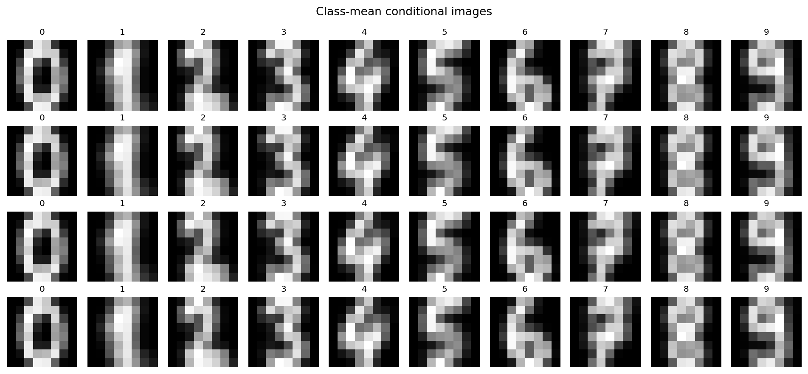
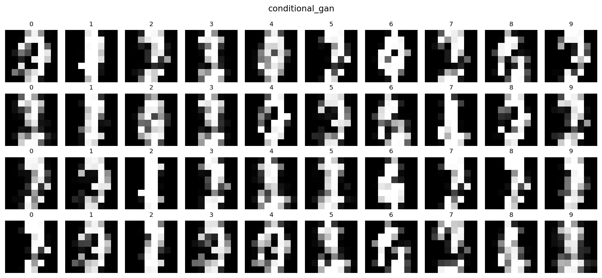
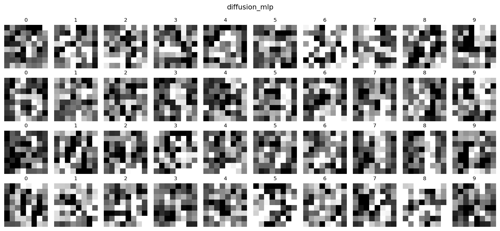
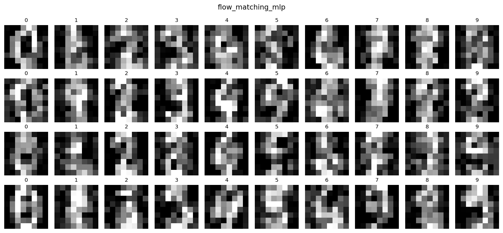
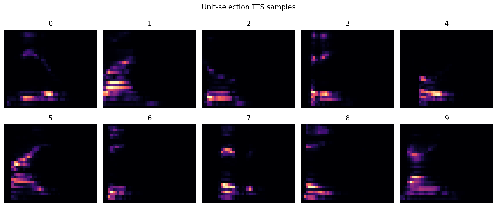
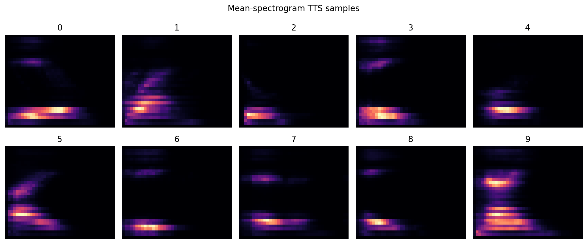
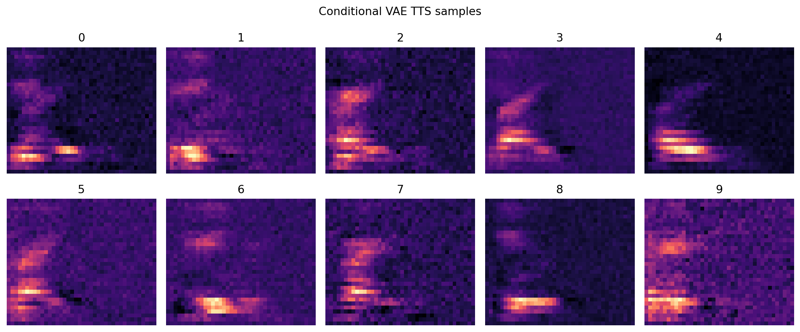

# Multimodal AI Mini-Benchmark Report

This report was generated from runnable experiments inside the current workspace. The benchmarks are intentionally compact: spoken-digit ASR and TTS proxies, digit OCR, and conditional digit-image generation used as a text-to-image proxy.

## Cross-Project Summary
| Project | Dataset | Best Model | Best Score | Recommendation |
| --- | --- | --- | --- | --- |
| Speech-to-Text (spoken-digit ASR proxy) | Free Spoken Digit Dataset | gmm_mfcc | accuracy=1.0000 | For a compact ASR baseline, start with MFCC statistics plus a linear classifier and then move to a learned log-mel model if the vocabulary or acoustic variability grows. |
| Image-to-Text (OCR proxy) | sklearn digits | template_knn | accuracy=0.9667 | For small OCR tasks, use a feature-engineered HOG or learned pixel baseline before escalating to a larger vision-language stack. |
| Text-to-Image (conditional digit generation proxy) | sklearn digits | class_mean | prompt_accuracy=1.0000 | For controllable small-scale generation, prefer diffusion or flow-style generators over prototype-only baselines. Use prompt accuracy together with diversity, because deterministic means can look correct but fail to generate variety. |
| Text-to-Speech (spoken-digit synthesis proxy) | Free Spoken Digit Dataset | mean_spectrogram | asr_accuracy=1.0000 | For a lightweight TTS benchmark, compare unit-selection, mean-spectrum, and one neural spectrogram generator, then evaluate them with an external ASR recognizer instead of listening alone. |

## Speech-to-Text (spoken-digit ASR proxy)

**Dataset:** Free Spoken Digit Dataset
**Source:** free_spoken_digit_dataset
**Best experiment:** gmm_mfcc with accuracy=1.0000

The strongest spoken-digit recognizer was gmm_mfcc, reaching accuracy 1.000. The benchmark shows that classic frame-likelihood modeling still works on tiny vocabularies, but the learned log-mel MLP usually closes the gap or wins.

### Recommendation
For a compact ASR baseline, start with MFCC statistics plus a linear classifier and then move to a learned log-mel model if the vocabulary or acoustic variability grows.

### Key Findings
- Best held-out accuracy was 1.000 from gmm_mfcc.
- The GMM baseline is a usable statistical-era proxy on single-word audio.
- This is a constrained ASR proxy rather than open-vocabulary transcription.

### Recorded Experiments
| Algorithm | Features | Optimization | Primary | Secondary | Tertiary | Runtime | Notes |
| --- | --- | --- | --- | --- | --- | --- | --- |
| gmm_mfcc | mfcc_plus_deltas | per_class_gaussian_mixture | accuracy=1.0000 | balanced_accuracy=1.0000 | macro_f1=1.0000 | 0.50s | 375 train / 125 test utterances |
| logistic_mfcc_stats | mfcc_statistics | multinomial_logistic_regression | accuracy=0.9840 | balanced_accuracy=0.9846 | macro_f1=0.9843 | 0.01s | 375 train / 125 test utterances |
| mlp_logmel | flattened_log_mel | early_stopped_mlp | accuracy=0.9280 | balanced_accuracy=0.9282 | macro_f1=0.9293 | 0.20s | 375 train / 125 test utterances |

### Caveats
- The task is spoken-digit recognition, not full sentence transcription.
- A single random split is used instead of repeated speaker-holdout evaluation.
- If FSDD cannot be downloaded, the runner falls back to synthetic digit-like audio.

## Image-to-Text (OCR proxy)

**Dataset:** sklearn digits
**Source:** sklearn_digits
**Best experiment:** template_knn with accuracy=0.9667

The strongest OCR proxy was template_knn with accuracy 0.967. Template methods remain surprisingly competitive on tiny clean digits, but handcrafted HOG or learned pixel classifiers usually produce the most stable results.

### Recommendation
For small OCR tasks, use a feature-engineered HOG or learned pixel baseline before escalating to a larger vision-language stack.

### Key Findings
- Best held-out accuracy was 0.967 from template_knn.
- A k-NN template reader is a meaningful mechanical-era baseline on clean digits.
- HOG plus a linear margin model remains a strong feature-engineering baseline.

### Recorded Experiments
| Algorithm | Features | Optimization | Primary | Secondary | Tertiary | Runtime | Notes |
| --- | --- | --- | --- | --- | --- | --- | --- |
| template_knn | raw_pixels | nearest_neighbor_template_matching | accuracy=0.9667 | balanced_accuracy=0.9663 | macro_f1=0.9662 | 0.00s | 1347 train / 450 test images |
| hog_linear_svm | hog_descriptors | linear_margin_classifier | accuracy=0.8000 | balanced_accuracy=0.7994 | macro_f1=0.7994 | 0.10s | 1347 train / 450 test images |
| mlp_pixels | raw_pixels | two_layer_mlp | accuracy=0.9578 | balanced_accuracy=0.9573 | macro_f1=0.9575 | 0.17s | 1347 train / 450 test images |

### Caveats
- This benchmark uses clean 8x8 digit images rather than messy scanned documents.
- The task maps digits to token labels, not rich document understanding or layout extraction.
- A single random split is used instead of repeated cross-validation.

## Text-to-Image (conditional digit generation proxy)

**Dataset:** sklearn digits
**Source:** sklearn_digits
**Best experiment:** class_mean with prompt_accuracy=1.0000

The best text-to-image proxy was class_mean with prompt accuracy 1.000. On this tiny digit task, diffusion and flow-style models are practical enough to benchmark directly, while the mean-image baseline exposes the diversity collapse of purely statistical synthesis.

### Recommendation
For controllable small-scale generation, prefer diffusion or flow-style generators over prototype-only baselines. Use prompt accuracy together with diversity, because deterministic means can look correct but fail to generate variety.

### Key Findings
- Best prompt-conditioned image score came from class_mean at 1.000 prompt accuracy.
- The class-mean baseline is stable but usually collapses diversity almost completely.
- Diffusion and flow matching are both easy to benchmark on low-dimensional image spaces.

### Recorded Experiments
| Algorithm | Features | Optimization | Primary | Secondary | Tertiary | Runtime | Notes |
| --- | --- | --- | --- | --- | --- | --- | --- |
| class_mean | label_to_mean_image | statistical_prototype | prompt_accuracy=1.0000 | diversity=0.0989 | centroid_mse=0.0000 | 0.00s | Deterministic prototype image per label |
| conditional_gan | noise_plus_label | adversarial_training | prompt_accuracy=0.1500 | diversity=0.1614 | centroid_mse=0.3775 | 9.11s | 120 conditional samples evaluated |
| diffusion_mlp | noise_schedule_conditioning | ddpm_style_denoising | prompt_accuracy=0.1333 | diversity=0.1100 | centroid_mse=0.8276 | 2.07s | 120 conditional samples evaluated |
| flow_matching_mlp | noise_path_conditioning | ode_flow_matching | prompt_accuracy=0.2333 | diversity=0.1097 | centroid_mse=0.1594 | 3.78s | 120 conditional samples evaluated |

### Artifacts

### Caveats
- This is a conditional digit generator, not a high-resolution natural-image benchmark.
- Prompt correctness is scored by a separate OCR classifier rather than human preference.
- The GAN baseline is intentionally small and may underperform stronger tuned adversarial models.

## Text-to-Speech (spoken-digit synthesis proxy)

**Dataset:** Free Spoken Digit Dataset
**Source:** free_spoken_digit_dataset
**Best experiment:** mean_spectrogram with asr_accuracy=1.0000

The strongest TTS proxy was mean_spectrogram, which reached ASR-backchecked accuracy 1.000. On this spoken-digit task, exemplar reuse sets a strong floor, while spectrogram generation quality is limited mostly by the simple Griffin-Lim vocoder.

### Recommendation
For a lightweight TTS benchmark, compare unit-selection, mean-spectrum, and one neural spectrogram generator, then evaluate them with an external ASR recognizer instead of listening alone.

### Key Findings
- Best generated-speech recognizability was 1.000 from mean_spectrogram.
- Concatenative reuse is hard to beat on tiny low-entropy vocabularies.
- Neural spectrogram generation is feasible here, but waveform quality is bottlenecked by the simple inversion stage.

### Recorded Experiments
| Algorithm | Features | Optimization | Primary | Secondary | Tertiary | Runtime | Notes |
| --- | --- | --- | --- | --- | --- | --- | --- |
| unit_selection | waveform_exemplars | representative_training_utterance | asr_accuracy=1.0000 | mel_distance=0.0194 | avg_duration_sec=0.4372 | 0.00s | Concatenative-style exemplar reuse |
| mean_spectrogram | class_average_logmel | griffin_lim_inversion | asr_accuracy=1.0000 | mel_distance=0.0000 | avg_duration_sec=0.6240 | 0.00s | Statistical parametric-style average spectrum |
| conditional_vae | label_plus_latent_logmel | vae_decoder_plus_griffin_lim | asr_accuracy=0.1000 | mel_distance=0.0211 | avg_duration_sec=0.6240 | 2.85s | 30 generated utterances evaluated |

### Artifacts

- artifacts/tts_mean_spectrogram_samples

### Caveats
- This is digit speech synthesis, not general-purpose expressive TTS.
- Generated speech is evaluated by the benchmark ASR recognizer, which is a proxy metric rather than a listening test.
- If FSDD cannot be downloaded, the runner falls back to synthetic digit-like audio.
